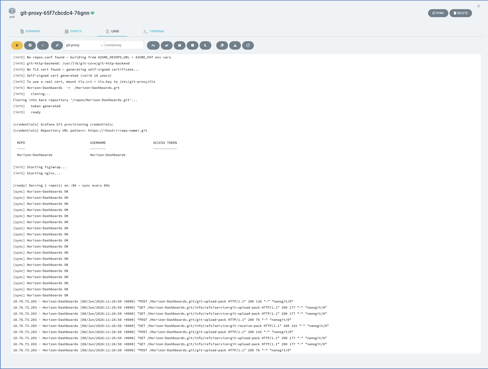
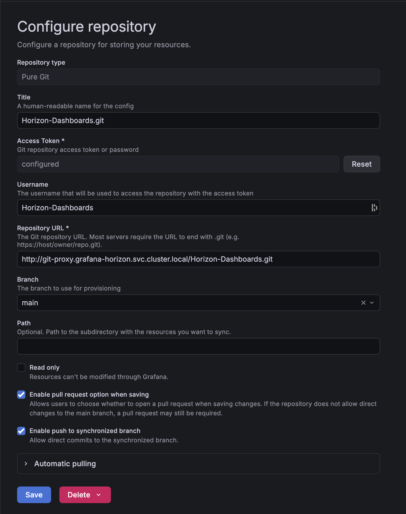
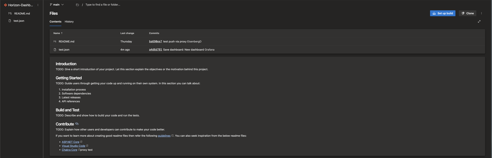
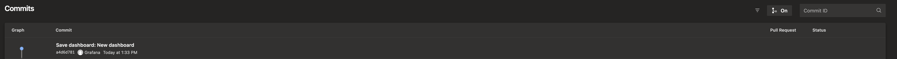

# Grafana Git Sync with Azure DevOps

This is a complete example of running the proxy in the same namespace as Grafana so that Grafana's built-in Git provisioning (Pure Git / Git v2 Smart HTTP) can sync dashboards from Azure DevOps.

## 1. Create the PAT secret

```bash
kubectl create secret generic git-proxy-credentials \
  --namespace grafana \
  --from-literal=AZURE_PAT=<your-azure-devops-pat>
```

The PAT needs **Code → Read** scope (add **Write** if you want push-back).

## 2. Deploy the proxy

For a single repo you can skip `repos.conf` entirely and use env vars. Deploy to the **same namespace as Grafana** so the in-cluster DNS name resolves:

```yaml
# ../k8s/base/deployment.yaml + the patch in ../k8s/pat/kustomization.yaml (relevant snippet)
env:
  - name: AZURE_DEVOPS_URL
    value: "https://dev.azure.com/<org>/<project>/_git/<repo>"
  - name: SYNC_INTERVAL
    value: "60"
  - name: AZURE_PAT
    valueFrom:
      secretKeyRef:
        name: git-proxy-credentials
        key: AZURE_PAT
```

The proxy derives the local repo name from the URL — `grafana-dashboards` becomes `/grafana-dashboards.git`.

## 3. Service

Deploy the Service in the same namespace:

```yaml
apiVersion: v1
kind: Service
metadata:
  name: git-proxy
  namespace: grafana          # same namespace as Grafana
  annotations:
    argocd.argoproj.io/sync-options: Replace=true   # avoids SSA port-name conflicts
spec:
  type: ClusterIP
  selector:
    app: git-proxy
  ports:
    - name: http
      port: 80
      targetPort: 80
      protocol: TCP
```

> **ArgoCD note:** the `Replace=true` annotation is required when managing this Service with ArgoCD server-side apply. Without it, a port rename between deploys leaves a stale entry that causes a duplicate port-name validation error.

## 4. Get the generated access token

On first start the proxy generates a random token per repo and prints it to stdout:

```
[credentials] Grafana Git provisioning credentials:

  REPO                   USERNAME                TOKEN
  ----                   --------                -----
  grafana-dashboards     grafana-dashboards      <generated-token>
```

```bash
kubectl logs -n grafana deploy/git-proxy | grep -A5 '\[credentials\]'
```

The token is stable across restarts (stored in the git-repos volume).



## 5. Configure Grafana

Use the in-cluster HTTP URL — no TLS needed for cluster-internal traffic:

```yaml
# Grafana dashboard provisioning (values.yaml extraObjects or ConfigMap)
apiVersion: 1
providers:
  - name: dashboards
    type: git
    options:
      url: http://git-proxy.grafana.svc.cluster.local/grafana-dashboards.git
      ref: main
      rootPath: dashboards/
      authType: basic
      username: grafana-dashboards      # repo name (from credentials table above)
      password: <generated-token>       # token from proxy logs
```

The URL pattern is always `http://git-proxy.<namespace>.svc.cluster.local/<repo-name>.git`.

In the Grafana UI (**Administration → Provisioning → Add repository**), set type **Pure Git** and fill in the URL, username, and token:



For a trusted cert in Kubernetes, apply [`k8s/tls-secret.yaml`](../k8s/tls-secret.yaml) and uncomment the TLS volume in [`k8s/base/deployment.yaml`](../k8s/base/deployment.yaml).

## Result

Once connected, saving a dashboard in Grafana creates a commit in Azure DevOps automatically. The proxy syncs bidirectionally — changes pushed to DevOps appear in Grafana, and saves in Grafana push back through the proxy to DevOps.

**Azure DevOps repo — dashboard JSON committed by Grafana:**



**Azure DevOps commit history — commit authored by Grafana:**


